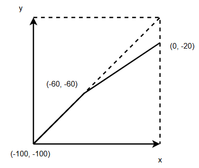
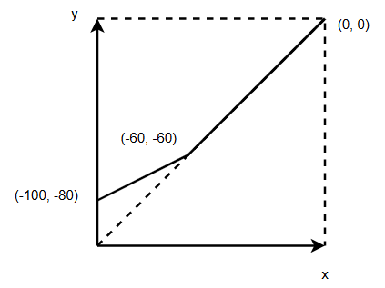
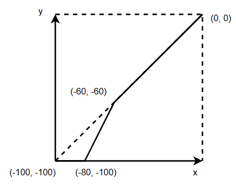
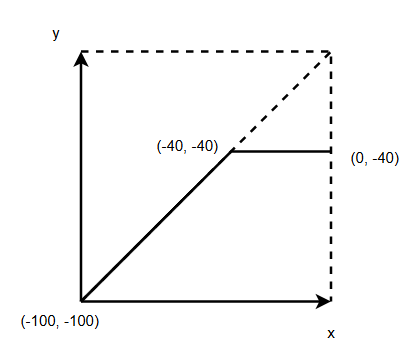

# Dynamic Range Control (DRC)

- [中文版](./README_DRC_CN.md)

Dynamic Range Control (DRC) is an audio processing technique that adjusts the dynamic range of an audio signal to better suit different playback environments and devices.
The dynamic range represents the difference between the quietest and loudest parts of an audio signal.

DRC includes compressors, expanders, limiters, and noise gates, which manipulate signal levels by applying gain curves.
Key steps include gain smoothing and makeup gain compensation, ensuring audio quality while avoiding overload and unwanted noise.

# Features

- Support all sample rates and channel numbers   
- Support bits per sample: s16、s24、s32    
- Support dynamic range curve configuration with up to 6 segmentation points
- Support makeup gain range: [-10.0, 10.0] dB
- Support attack time range: [0, 500] ms
- Support release time range: [0, 500] ms  
- Support hold time range: [0, 100] ms
- Support knee width range: [0.0, 10.0] dB for smooth curve transitions
- Support data layout: interleaved, non-interleaved
- Support in-place processing

# Performance

The system menuconfig is:  
|   HW_Version   | IDF_Version  | CPU Frequency | SPI Ram  |
|       --       |   --         |  --           |     --   |  
|   ESP32-S3R8   | release/v5.5 | 240MHz        |   80MHz  |   

| Bits per sample| Memory(Byte) | CPU loading(%) |
|       --       |  --          |     --         |  
|       16       |  < 11K       |    < 0.4       | 
|       24       |  < 11k       |    < 0.5       | 
|       32       |  < 11k       |    < 0.4       | 

Note:   
    1) The test music is 8k mono, and the CPU loading of music with other sampling rate and channel is about `sample rate / 8000 * channel` times that of this.    
    2) The CPU loading in the table is an average number.   

# DRC Curve Scenarios

The following section illustrates different DRC curve scenarios with visual diagrams and their applications:

| Scenario             | Output Behavior     | Application          | Illustration |
| -------------------- | ------------------- | ------------------- | ------------ |
| Downward Compressor  | Reduces loud peaks  | Noise reduction, silence enhancement |  |
| Upward Compressor    | Boosts low-level detail | Speech intelligibility |  |
| Downward Expander    | Attenuates low-level noise | Noise reduction, silence enhancement |  |
| Upward Expander      | Increases dynamic contrast | Music production |  |
| Noise Gate           | Eliminates background noise | Recording, live audio |  |
| Limiter              | Prevents clipping   | Mastering, broadcasting |  |

# Usage

Here is an example of using [DRC](../example/esp_audio_effects_demo/main/esp_audio_effects_demo.c)

# FAQ

1) What are the curve points used for?

    Curve points define the dynamic range control (DRC) curve, which determines how input signal levels are mapped to output levels. Each curve point consists of:

    - **x-coordinate:** Input level (in dB)
    - **y-coordinate:** Output level (in dB)

    **Requirements:**
    - The curve must include points at **0 dB** and **-100 dB**
    - Up to **6 points** can be defined in total

    These points allow you to design various compression, limiting, or expansion curves by specifying how the DRC should respond at different input levels.

2) What is the difference between **hard knee** and **soft knee**?

    - **Hard knee** (`knee_width = 0`):  
    Compression is applied immediately when the signal exceeds the threshold, resulting in a sharp corner in the dynamic range curve.

    - **Soft knee** (`knee_width > 0`):  
    Compression is gradually applied over a region around the threshold, resulting in a smoother transition. The larger the `knee_width`, the wider the dB range over which compression is gradually introduced.

3) How should Attack, Release, and Hold times be set? What are their typical use cases?

    **Attack Time (`attack_time`)**

    - **Definition:** TResponse time of control gain attenuation.
    - **Range:** 0 – 500 ms
    - **Typical Use Cases:**
    - **Short Attack (<10 ms):** Quickly suppresses transient peaks, such as plosives, drum hits, or short bursts of noise.
    - **Long Attack (>30 ms):** Preserves transients in vocals, guitars, or percussion, resulting in a more natural sound.

    **Release Time (`release_time`)**

    - **Definition:** Response time of recovery with increased gain.
    - **Range:** 0 – 500 ms
    - **Typical Use Cases:**
    - **Short Release (50–100 ms):** Enhances speech intelligibility, suitable for real-time communication scenarios.
    - **Long Release (200–500 ms):** Provides smooth gain recovery in music playback or mastering, helping to avoid "pumping" artifacts.

    **Hold Time (`hold_time`)**

    - **Definition:** The delay time to control gain change.
    - **Range:** 0 – 100 ms (recommended to be less than Attack and Release times)
    - **Typical Use Cases:**
    - **Speech:** Prevents frequent gain changes due to short pauses, reducing "breathing" effects.
    - **Music:** Stabilizes the dynamic range and avoids unnatural level fluctuations.
