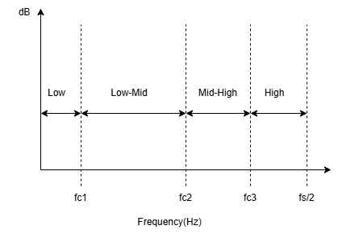
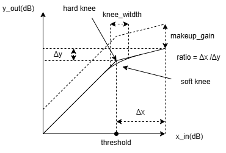

# MBC (Multi-Band Compressor)

- [中文版](./README_MBC_CN.md)

`MBC (Multi-Band Compressor)` is a sophisticated audio dynamics processing module that provides frequency-selective compression capabilities. Unlike traditional single-band compressors that process the entire audio spectrum uniformly, MBC divides the input signal into multiple frequency bands and applies independent compression processing to each band.

# Features

- Support all sample rates and channel numbers   
- Support bits per sample: s16、s24、s32    
- Four-band frequency division with configurable crossover points
- Independent compression parameters for each frequency band
- Support threshold range: (-100, 0) dB
- Support ratio range: [1, +∞)
- Support makeup gain range: [-10, 10] dB
- Support attack time range: [0, 500] ms
- Support release time range: [0, 500] ms  
- Support hold time range: [0, 100] ms
- Support knee width range: [0, 10] dB for smooth curve transitions
- Support solo and bypass functions for each band
- Support data layout: interleaved, non-interleaved
- Support in-place processing

# Performance

The system menuconfig is:  
|   HW_Version   | IDF_Version  | CPU Frequency | SPI Ram  |
|       --       |   --         |  --           |     --   |  
|   ESP32-S3R8   | release/v5.5 | 240MHz        |   80MHz  |   

| Bits per sample| Memory(Byte) | CPU loading(%) |
|       --       |  --          |     --         |  
|       16       |  < 43K       |    < 3.2       | 
|       24       |  < 43k       |    < 4.1       | 
|       32       |  < 44k       |    < 4.7       | 

Note:   
    1) The test music is 8k mono, and the CPU loading of music with other sampling rate and channel is about `sample rate / 8000 * channel` times that of this.    
    2) The CPU loading in the table is an average number.   

# Module Architecture

## Frequency Band Division

The MBC divides the audio spectrum into four frequency bands using three crossover points:



## Compression Parameters

Each frequency band can be configured with independent compression parameters:



| Parameter | Description | Range | Effect |
|-----------|-------------|-------|--------|
| **Threshold** | Level where compression begins | (-100, 0) dB | Determines when compression activates |
| **Ratio** | Amount of compression applied | [1, +∞) | Controls compression strength |
| **Makeup Gain** | Gain compensation after compression | [-10, 10] dB | Restores overall level |
| **Attack Time** | Speed of gain reduction | [0, 500] ms | How quickly compression responds |
| **Release Time** | Speed of gain recovery | [0, 500] ms | How quickly compression releases |
| **Hold Time** | Delay before gain changes | [0, 100] ms | Prevents rapid gain fluctuations |
| **Knee Width** | Smoothness of threshold transition | [0, 10] dB | Hard knee (0) vs soft knee (>0) |

## MBC Signal Processing Pipeline

The MBC module follows a structured signal processing pipeline:

```
Input Audio Signal
        ↓
   [Pre-processing]
        ↓
[Frequency Band Splitter] ← Linkwitz-Riley Crossover Filters
        ↓
    +-----------+-----------+-----------+-----------+
    |    Low    |  Low-Mid  | High-Mid  |    High   |
    +-----------+-----------+-----------+-----------+
        ↓
   [Band Mixer]
        ↓
   [Post-processing]
        ↓
   Output Audio Signal
```

## Solo and Bypass Functions

The MBC provides solo and bypass functions for each frequency band:

### Solo Function
- **Purpose**: Isolate and listen to a specific frequency band while muting all other bands
- **Use Case**: Monitoring individual bands during mixing and mastering
- **API**: `esp_ae_mbc_set_solo()` and `esp_ae_mbc_get_solo()`

### Bypass Function
- **Purpose**: Allow a selected frequency band to pass through without compression processing
- **Use Case**: Temporarily disable compression for specific frequency ranges
- **API**: `esp_ae_mbc_set_bypass()` and `esp_ae_mbc_get_bypass()`

# Usage

Here is an example of using [MBC](../example/esp_audio_effects_demo/main/esp_audio_effects_demo.c)

# FAQ

1) How does MBC differ from single-band compression?

    MBC provides much more precise control by processing different frequency ranges independently. While single-band compression affects the entire audio spectrum uniformly, MBC allows you to:
    - Compress bass frequencies more aggressively to control low-end rumble
    - Apply gentle compression to mid frequencies to preserve vocal clarity
    - Use different attack/release times for different frequency ranges
    - Address specific frequency-related issues without affecting other parts of the spectrum

2) How should I set crossover frequencies?

    Crossover frequency selection depends on your audio content and goals:

    - **Low Band (0Hz to low_fc)**: Set between 80-200Hz for bass control
    - **Low-Mid Band (low_fc to mid_fc)**: Set between 200Hz-2kHz for vocal and fundamental frequencies
    - **High-Mid Band (mid_fc to high_fc)**: Set between 2-8kHz for presence and clarity
    - **High Band (high_fc to Nyquist)**: Set between 8-20kHz for air and brightness

    **General Guidelines:**
    - Avoid setting crossovers too close to fundamental frequencies of important instruments
    - Use 1.5-2 octave separation between crossover points for clean band separation
    - Consider the Fletcher-Munson curves for psychoacoustic optimization

3) What are the typical parameter settings for different applications?

    **Vocal Enhancement**
    - Low Band (0-400Hz): Bypass (1:1 ratio, 0dB threshold, 10ms attack, 100ms release, 0dB gain)
    - Low-Mid Band (400Hz-2.1kHz): Heavy compression (4:1 ratio, -18dB threshold, 1ms attack, 200ms release, 6dB makeup gain)
    - High-Mid Band (2.1kHz-6kHz): Heavy compression (4:1 ratio, -20dB threshold, 1ms attack, 200ms release, 7dB makeup gain)
    - High Band (6kHz+): Bypass (1:1 ratio, 0dB threshold, 10ms attack, 100ms release, 0dB gain)
    - Crossover Points: 400Hz, 2.1kHz, 6kHz

    **Bass Enhancement**
    - Low Band (0-80Hz): Heavy compression (2.5:1 ratio, -20dB threshold, 1ms attack, 200ms release, 6dB makeup gain)
    - Low-Mid Band (80Hz-250Hz): Moderate compression (2:1 ratio, -18dB threshold, 1ms attack, 200ms release, 6dB makeup gain)
    - High-Mid Band (250Hz-10kHz): Bypass (1:1 ratio, 0dB threshold, 10ms attack, 100ms release, 0dB gain)
    - High Band (10kHz+): Bypass (1:1 ratio, 0dB threshold, 10ms attack, 100ms release, 0dB gain)
    - Crossover Points: 80Hz, 250Hz, 10kHz

    **Treble Enhancement**
    - Low Band (0-120Hz): Light compression (2.5:1 ratio, -10dB threshold, 10ms attack, 100ms release, -2dB gain)
    - Low-Mid Band (120Hz-4.5kHz): Light compression (2:1 ratio, -10dB threshold, 10ms attack, 100ms release, -2dB gain)
    - High-Mid Band (4.5kHz-10kHz): Moderate compression (1.8:1 ratio, -20dB threshold, 10ms attack, 100ms release, 5dB makeup gain)
    - High Band (10kHz+): Moderate compression (2:1 ratio, -22dB threshold, 10ms attack, 100ms release, 5dB makeup gain)
    - Crossover Points: 120Hz, 4.5kHz, 10kHz

    **Walkie-Talkie**
    - Low Band (0-991Hz): Bypass (1:1 ratio, 0dB threshold, 10ms attack, 100ms release, 0dB gain)
    - Low-Mid Band (991Hz-2.57kHz): Very heavy compression (4:1 ratio, -30dB threshold, 10ms attack, 100ms release, 18dB makeup gain)
    - High-Mid Band (2.57kHz-10kHz): Bypass (1:1 ratio, 0dB threshold, 10ms attack, 100ms release, 0dB gain)
    - High Band (10kHz+): Bypass (1:1 ratio, 0dB threshold, 10ms attack, 100ms release, 0dB gain)
    - Crossover Points: 991Hz, 2.57kHz, 10kHz

    **Toy Audio**
    - Low Band (0-921Hz): Heavy limiting (20:1 ratio, -60dB threshold, 10ms attack, 100ms release, -18dB gain)
    - Low-Mid Band (921Hz-1.78kHz): Moderate compression (3:1 ratio, -30dB threshold, 10ms attack, 100ms release, 0dB gain)
    - High-Mid Band (1.78kHz-4kHz): Bypass (1:1 ratio, 0dB threshold, 10ms attack, 100ms release, 0dB gain)
    - High Band (4kHz+): Heavy limiting (20:1 ratio, -60dB threshold, 10ms attack, 100ms release, 0dB gain)
    - Crossover Points: 921Hz, 1.78kHz, 4kHz

    **Sibilance Reduction**
    - Low Band (0-54.8Hz): Bypass (1:1 ratio, 0dB threshold, 10ms attack, 100ms release, 0dB gain)
    - Low-Mid Band (54.8Hz-4kHz): Bypass (1:1 ratio, 0dB threshold, 10ms attack, 100ms release, 0dB gain)
    - High-Mid Band (4kHz-10.15kHz): Heavy compression (4:1 ratio, -25dB threshold, 10ms attack, 100ms release, 0dB gain)
    - High Band (10.15kHz+): Bypass (1:1 ratio, 0dB threshold, 10ms attack, 100ms release, 0dB gain)
    - Crossover Points: 54.8Hz, 4kHz, 10.15kHz

    **Broadcast**
    - Low Band (0-137Hz): Moderate compression (3:1 ratio, -20.2dB threshold, 1ms attack, 100ms release, 1dB makeup gain)
    - Low-Mid Band (137Hz-1.15kHz): Light compression (2:1 ratio, -17.6dB threshold, 1ms attack, 100ms release, 0dB gain)
    - High-Mid Band (1.15kHz-6.91kHz): Light compression (2:1 ratio, -24.8dB threshold, 1ms attack, 100ms release, 0dB gain)
    - High Band (6.91kHz+): Moderate compression (3:1 ratio, -25dB threshold, 1ms attack, 100ms release, 3dB makeup gain)
    - Crossover Points: 137Hz, 1.15kHz, 6.91kHz

    **Pop Music Master**
    - Low Band (0-120Hz): Moderate compression (2.3:1 ratio, -22dB threshold, 2ms attack, 100ms release, 0dB gain)
    - Low-Mid Band (120Hz-2kHz): Moderate compression (2.6:1 ratio, -22dB threshold, 3ms attack, 100ms release, 0dB gain)
    - High-Mid Band (2kHz-10kHz): Moderate compression (2.6:1 ratio, -22dB threshold, 2.5ms attack, 100ms release, 0dB gain)
    - High Band (10kHz+): Heavy compression (3:1 ratio, -30dB threshold, 3ms attack, 100ms release, 0dB gain)
    - Crossover Points: 120Hz, 2kHz, 10kHz
