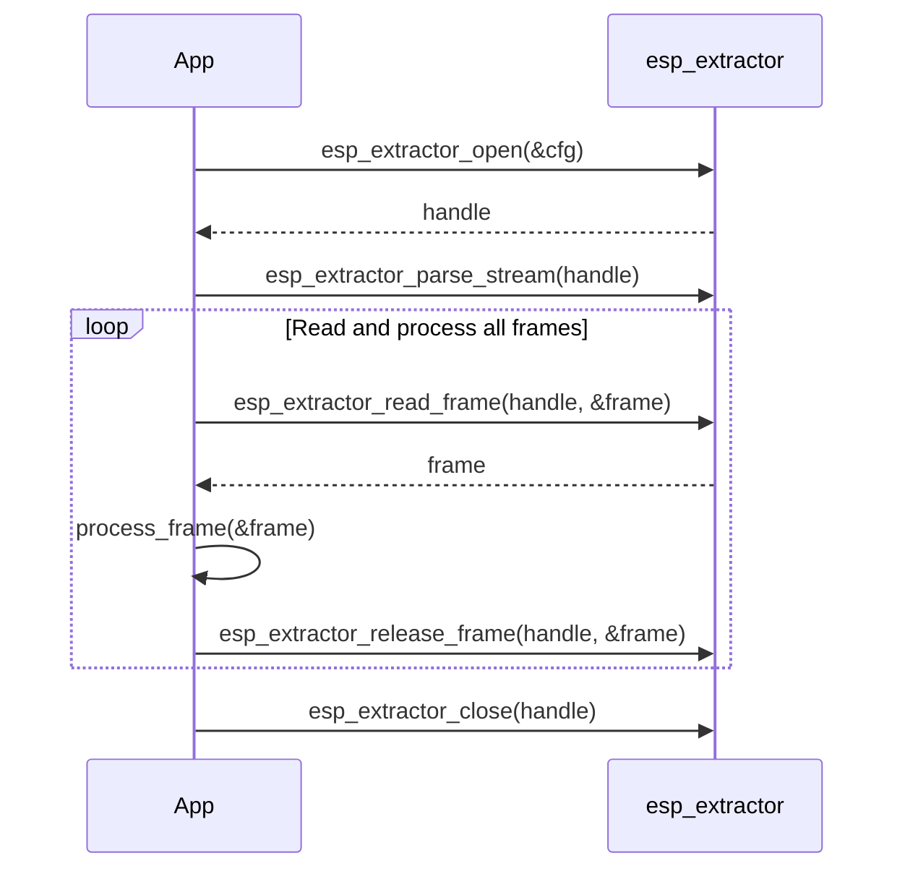

# ESP_Extractor

**ESP_Extractor** is a lightweight and high-performance multimedia stream extraction library tailored for embedded systems, particularly the **Espressif** platform. It enables efficient parsing and extraction of audio and video streams from various container formats, enabling efficient downstream decoding, processing, or remuxing.

---

## ✨ Key Features

### 🚀 High Performance & Efficiency
- **Unified API**: A consistent interface for all supported formats (MP4, TS, FLV, WAV, etc.).
- **Auto Format Detection**: Probe input data for accurate format detection.
- **Memory Pool Management**: Output frames are directly placed in a configurable memory pool, minimizing data copying.
- **Input Data Caching**: Integrated data caching improves parsing throughput and reduces I/O overhead.
- **Efficient Seeking**: Uses different seek strategies for each extractor type to achieve fast time-based seeking.
- **Custom Extractor Support**: Unified API enables integration of user-defined extractors.

### 🎯 Flexible Input Source Handling
- **Selective Stream Extraction**: Choose to extract audio, video, or both via extraction masks.
- **File Input**: Read directly from files with automatic format recognition.
- **Buffer Input**: In-memory extraction support for real-time or constrained environments.
- **Custom I/O**: Plug-and-play read/seek callbacks for non-standard sources (e.g., flash, network).
- **Streaming Media Support**: Designed with support for streaming input and resume playback.

## 🛠️ Extensibility & Customization
- **Track Selection**: Dynamically enable or disable specific audio/video tracks.
- **Playback Resume**: Save and restore extractor state for seamless resume.
- **Deep Indexing**: Optional full-file parsing for accurate seeking.
- **Dynamic Indexing**: Lightweight, memory-efficient indexing for large files.
- **Alignment Support**: Configurable output alignment to meet specific hardware decoder requirements.
- **Metadata Support**: Built-in ID3 tag parsing support.
- **Modular Design**: Unused extractors can be disabled via `menuconfig` to minimize binary footprint.

---

## 📦 Supported Containers & Codecs

| Container | MP4 | TS | FLV | WAV | OGG | AVI | CAF | AudioES |
|-----------|-----|----|-----|-----|-----|-----|-----|---------|
| **Audio Codecs** |
| PCM       | ✅  | ❌ | ✅  | ✅  | ❌  | ✅  | ✅  | ❌     |
| AAC       | ✅  | ✅ | ✅  | ✅  | ❌  | ✅  | ✅  | ✅     |
| MP3       | ✅  | ✅ | ✅  | ❌  | ❌  | ✅  | ❌  | ✅     |
| ADPCM     | ❌  | ❌ | ❌  | ✅  | ❌  | ❌  | ❌  | ❌     |
| G711-Alaw | ❌  | ❌ | ❌  | ✅  | ❌  | ❌  | ✅  | ❌     |
| G711-Ulaw | ❌  | ❌ | ❌  | ✅  | ❌  | ❌  | ✅  | ❌     |
| AMR-NB    | ❌  | ❌ | ❌  | ✅  | ❌  | ❌  | ❌  | ✅     |
| AMR-WB    | ❌  | ❌ | ❌  | ✅  | ❌  | ❌  | ❌  | ✅     |
| FLAC      | ❌  | ❌ | ❌  | ❌  | ✅  | ❌  | ❌  | ✅     |
| VORBIS    | ❌  | ❌ | ❌  | ❌  | ✅  | ❌  | ❌  | ❌     |
| OPUS      | ❌  | ❌ | ❌  | ❌  | ✅  | ❌  | ❌  | ❌     |
| ALAC      | ✅   | ❌ | ❌  | ❌ | ❌  | ❌  | ✅  | ❌     |
| **Video Codecs** |
| H264      | ✅  | ✅ | ✅  | ❌  | ❌  | ✅  | ❌  | ❌     |
| MJPEG     | ✅  | ✅ | ✅  | ❌  | ❌  | ✅  | ❌  | ❌     |

> **Note:**
>
> **AudioES**: Encoded audio data output directly from the codec, without container encapsulation or multiplexing (supported formats: AAC, MP3, AMR, FLAC).
>
> **MJPEG Container Support**:
> MJPEG in TS and FLV containers uses custom codec identifiers:
> - **FLV Container**: Codec ID `1` (MJPEG)
> - **TS Container**: Stream ID `6` (MJPEG)
>
> **Implementation Reference**:
> For technical details, refer to [ffmpeg_mjpeg.patch](ffmpeg_mjpeg.patch).
>
> **File Size Limitation**:
> To optimize performance and minimize memory usage on the Espressif platform, the `esp_extractor` currently supports files **under 4GB**—the maximum file size limit imposed by the **FatFS** file system.
---

## 🧩 Core API Usage

### Initialization & Configuration
```c
// Register all supported extractors
esp_extractor_register_default();

// Open an extractor instance with configuration
esp_extractor_open(config, &extractor);
```

### Stream Parsing & Control
```c
// Parse the stream header
esp_extractor_parse_stream(extractor);

// Query stream count and metadata
esp_extractor_get_stream_num(extractor, stream_type, &stream_num);
esp_extractor_get_stream_info(extractor, stream_type, stream_idx, &info);

// Enable or disable specific streams
esp_extractor_enable_stream(extractor, stream_type, stream_idx, enable);
```

### Frame Read & Release
```c
// Read a media frame
esp_extractor_read_frame(extractor, &frame_info);

// Release resources for the frame
esp_extractor_release_frame(extractor, &frame_info);
```

### ⏱️ Seek & Navigation
```c
// Seek to time position (in ms)
esp_extractor_seek(extractor, time_pos);
```

### 🛠️ Advanced Control
```c
// Perform extended control operations. Some advanced controls must be performed before `esp_extractor_parse_stream`.
// For supported control types, refer to the corresponding extractor header files for details.
esp_extractor_ctrl(extractor, ctrl_type, ctrl, ctrl_size);
```

### ❌ Cleanup
```c
// Close the extractor and free resources
esp_extractor_close(extractor);

// Unregister all extractor modules
esp_extractor_unregister_all();
```

---

## ▶️ Typical Call Sequence



> For a working example, refer to: [main.c](examples/extractor_test/main/main.c)

---

## 🔧 Custom Extractor Integration

To register your own extractor module, use the unified API:

```c
esp_extractor_register(&your_custom_extractor);
```

- Reference implementation: [extractor_cust.c](examples/extractor_test/main/extractor_cust.c)
- Be sure to enable `EXTRACTOR_CUSTOM_SUPPORT` via `menuconfig`.

---

## 📉 Reducing Binary Size

If you're using `esp_extractor_register_default()`, you can minimize binary footprint by deselecting unused extractors in **`menuconfig`** under the extractor module options.

---

## 💾 Heap Usage

Heap usage of the extractor is mainly from a **parse cache** and a **memory pool**. The parse cache size is fixed at 4KB. The memory pool size is user-configurable; recommended at least **2 × maximum frame size**.

Some formats use an index table for efficient seeking. For large files, building the full index can use a lot of memory. To reduce it you can: disable index table buildup when seek is not needed, or use dynamic index table loading (which seeks back to parse the index gradually). See each extractor’s header/docs for details.

---

## 🤝 Integration with Other Modules

To remux or transcode extracted streams into other containers, consider using:

👉 [esp_muxer](https://github.com/espressif/esp-adf-libs/tree/master/esp_muxer) – for encapsulating media into formats like MP4 or TS.

---

## 📬 Contact & Support

🛠 Found a bug? Have feature suggestions?
Please open an issue here: [ESP-GMF Issues](https://github.com/espressif/esp-gmf/issues)

We’re here to help!
