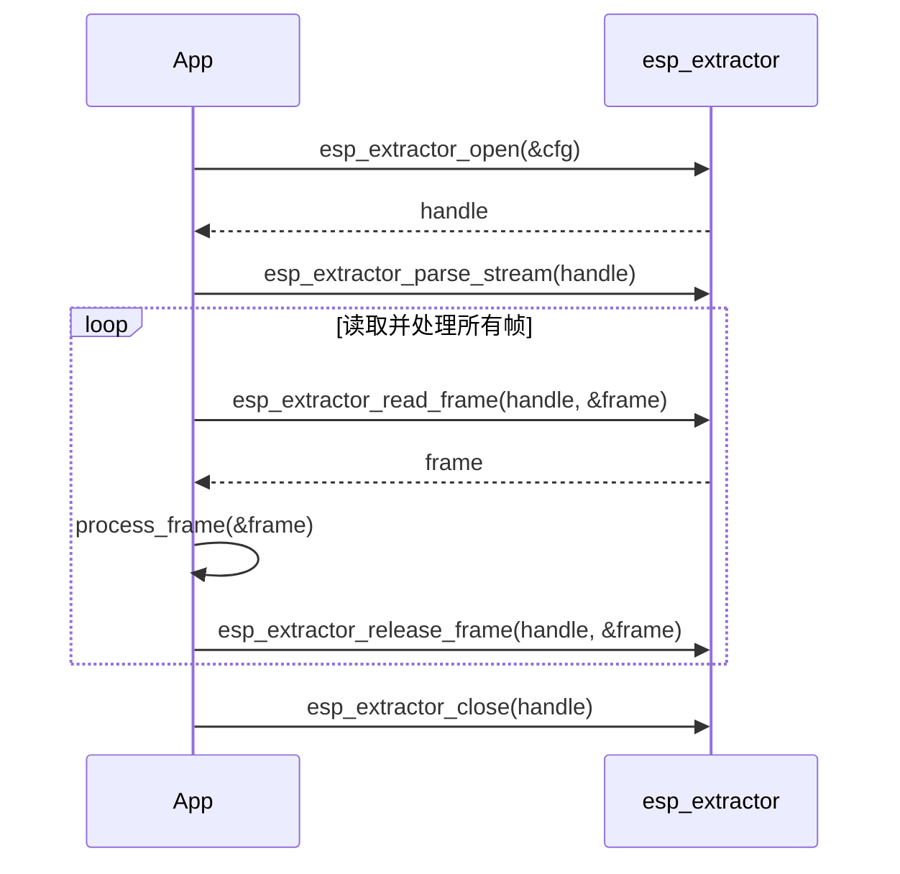

# ESP_Extractor

**ESP_Extractor** 是一个专为嵌入式系统（特别是 **Espressif** 平台）设计的轻量级高性能多媒体流提取库。它能够高效地解析和提取各种容器格式中的音频和视频流，以便支持下游解码、处理或重新封装。

---

## ✨ 核心特性

### 🚀 高性能与效率
- **统一 API**：为所有支持的格式（MP4、TS、FLV、WAV 等）提供一致的接口。
- **自动格式检测**：通过输入数据进行探测，实现准确的格式检测。
- **内存池管理**：输出帧直接放入可配置的内存池中，最大限度地减少数据拷贝。
- **输入数据缓存**：集成数据缓存机制，提升解析吞吐量并减少 I/O 开销。
- **高效定位**：针对每种提取器类型使用不同的定位策略，实现快速的基于时间的定位。
- **自定义提取器支持**：统一 API 支持集成用户定义的格式。

### 🎯 灵活的输入源处理
- **选择性流提取**：通过提取掩码选择提取音频、视频或两者。
- **文件输入**：直接从文件读取，支持自动格式识别。
- **缓冲区输入**：支持内存提取，适用于实时或受限环境。
- **自定义 I/O**：即插即用的读/定位回调，支持非标准源（如闪存、网络）。
- **流媒体支持**：专为流媒体输入和恢复播放而设计。

## 🛠️ 扩展性与定制化
- **轨道选择**：动态启用或禁用特定的音频/视频轨道。
- **播放恢复**：保存和恢复提取器状态，实现无缝恢复。
- **深度索引**：可选的全文件解析，以实现精确定位。
- **动态索引**：轻量级、内存高效的索引，适用于大文件。
- **对齐支持**：可配置的输出对齐，以满足特定硬件解码器的要求。
- **元数据支持**：内置 ID3 标签解析支持。
- **模块化设计**：可以通过 `menuconfig` 禁用未使用的提取器，以最小化二进制占用空间。

---

## 📦 支持的容器和编解码器

| 容器      | MP4 | TS | FLV | WAV | OGG | AVI | CAF | AudioES |
|-----------|-----|----|-----|-----|-----|-----|-----|---------|
| **音频编解码器** |
| PCM       | ✅  | ❌ | ✅  | ✅  | ❌  | ✅  | ✅  | ❌     |
| AAC       | ✅  | ✅ | ✅  | ✅  | ❌  | ✅  | ✅  | ✅     |
| MP3       | ✅  | ✅ | ✅  | ❌  | ❌  | ✅  | ❌  | ✅     |
| ADPCM     | ❌  | ❌ | ❌  | ✅  | ❌  | ❌  | ❌  | ❌     |
| G711-Alaw | ❌  | ❌ | ❌  | ✅  | ❌  | ❌  | ✅  | ❌     |
| G711-Ulaw | ❌  | ❌ | ❌  | ✅  | ❌  | ❌  | ✅  | ❌     |
| AMR-NB    | ❌  | ❌ | ❌  | ✅  | ❌  | ❌  | ❌  | ✅     |
| AMR-WB    | ❌  | ❌ | ❌  | ✅  | ❌  | ❌  | ❌  | ✅     |
| FLAC      | ❌  | ❌ | ❌  | ❌  | ✅  | ❌  | ❌  | ✅     |
| VORBIS    | ❌  | ❌ | ❌  | ❌  | ✅  | ❌  | ❌  | ❌     |
| OPUS      | ❌  | ❌ | ❌  | ❌  | ✅  | ❌  | ❌  | ❌     |
| ALAC      | ✅  | ❌ | ❌  | ❌  | ❌  | ❌  | ✅  | ❌     |
| **视频编解码器** |
| H264      | ✅  | ✅ | ✅  | ❌  | ❌  | ✅  | ❌  | ❌     |
| MJPEG     | ✅  | ✅ | ✅  | ❌  | ❌  | ✅  | ❌  | ❌     |

> **注意：**
>
> **AudioES**：直接从编解码器输出的编码音频数据，不含容器封装或复用（支持格式：AAC、MP3、AMR、FLAC）。
>
> **MJPEG 容器支持说明**：
> TS 和 FLV 容器中的 MJPEG 使用自定义编解码器标识符：
> - **FLV**：编解码器 ID `1` 用于 MJPEG
> - **TS**：流 ID `6` 用于 MJPEG
>
> **实现参考**：
> 详见 [ffmpeg_mjpeg.patch](ffmpeg_mjpeg.patch) 了解技术实现细节。
>
> **文件大小限制**：
> 为提升运行效率并降低内存占用，当前 `esp_extractor` 组件仅支持处理小于 4GB 的文件（此限制源于 FatFS 文件系统的最大支持容量）。
---

## 🧩 核心 API 使用

### 初始化与配置
```c
// 注册所有支持的提取器
esp_extractor_register_default();

// 使用配置打开提取器实例
esp_extractor_open(config, &extractor);
```

### 流解析与控制
```c
// 解析流头
esp_extractor_parse_stream(extractor);

// 查询流数量和元数据
esp_extractor_get_stream_num(extractor, stream_type, &stream_num);
esp_extractor_get_stream_info(extractor, stream_type, stream_idx, &info);

// 启用或禁用特定流
esp_extractor_enable_stream(extractor, stream_type, stream_idx, enable);
```

### 帧读取与释放
```c
// 读取媒体帧
esp_extractor_read_frame(extractor, &frame_info);

// 释放帧资源
esp_extractor_release_frame(extractor, &frame_info);
```

### ⏱️ 定位与导航
```c
// 定位到时间位置（毫秒）
esp_extractor_seek(extractor, time_pos);
```

### 🛠️ 高级控制
```c
// 执行扩展控制操作。某些高级控制必须在 `esp_extractor_parse_stream` 之前执行。
// 有关支持的控制类型，请参阅相应的提取器头文件以获取详细信息。
esp_extractor_ctrl(extractor, ctrl_type, ctrl, ctrl_size);
```

### ❌ 清理
```c
// 关闭提取器并释放资源
esp_extractor_close(extractor);

// 注销所有提取器模块
esp_extractor_unregister_all();
```

---

## ▶️ 典型调用时序



> 完整示例请参考：[main.c](examples/extractor_test/main/main.c)

---

## 🔧 自定义提取器

要注册您自己的提取器模块，请使用统一 API：

```c
esp_extractor_register(&your_custom_extractor);
```

- 参考实现：[extractor_cust.c](examples/extractor_test/main/extractor_cust.c)
- 请确保通过 `menuconfig` 启用 `EXTRACTOR_CUSTOM_SUPPORT`。

---

## 📉 减少二进制大小

如果您使用 `esp_extractor_register_default()`，可以通过在 **`menuconfig`** 的提取器模块选项下取消选择未使用的提取器来最小化二进制占用空间。

---

## 💾 堆内存占用

提取器的堆内存主要来自 **解析缓存** 和 **内存池**。解析缓存大小固定为 4KB。内存池大小可由用户配置，建议至少为 **2 × 最大帧大小**。

部分格式使用索引表以实现高效定位。对于大文件，构建完整索引会占用较多内存。若要降低占用，可以：在不需要定位时关闭索引表构建，或使用动态索引表加载（通过回退解析逐步构建索引）。具体支持情况请参阅各提取器的头文件或文档。

---

## 🤝 与其他模块集成

要将提取的流重新封装或转码到其他容器中，请考虑使用：

👉 [esp_muxer](https://github.com/espressif/esp-adf-libs/tree/master/esp_muxer) – 用于将媒体封装为 MP4 或 TS 等格式。

---

## 📬 联系与支持

🛠 发现错误？有功能建议？
请在此处提交问题：[ESP-GMF Issues](https://github.com/espressif/esp-gmf/issues)

我们随时为您提供帮助！
