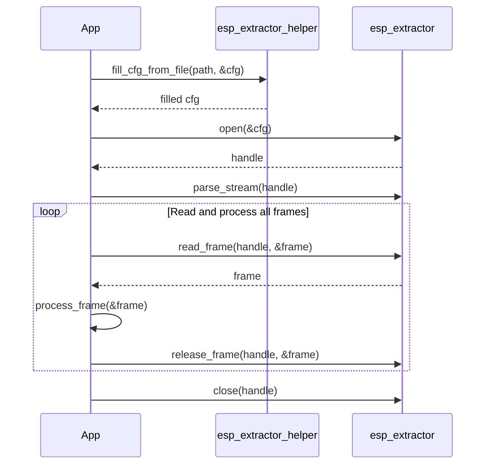

# ESP Extractor Test Application

## 📖 Overview

This test application demonstrates how to use the `esp_extractor` framework on the Espressif platform to extract audio and video frames from media files. It covers three main scenarios:

1.  **Standard Extractor**: Using built-in extractors (MP4, TS, FLV, etc.) with a helper to simplify file-based configuration.
2.  **Raw Extractor**: Extracting frames from raw elementary streams (like Opus, AAC, or H.264) that lack a container header.
3.  **Custom Extractor**: Implementing and registering a user-defined container format handler.

---

## 🚀 Key Scenarios

### 1. Standard Extractor (with Helper)
The `extractor_helper` provides convenient APIs to allocate configuration directly from a file path.

```c
// Register default extractors
esp_extractor_register_default();

// Use helper to create config from file
esp_extractor_config_t *cfg = esp_extractor_alloc_file_config(url, ESP_EXTRACT_MASK_AV, POOL_SIZE);

// Standard flow: open -> parse -> read loop
esp_extractor_open(cfg, &extractor);
esp_extractor_parse_stream(extractor);
// ... read_frame loop ...
```

#### ⏱️ Typical Call Sequence



### 2. Raw Extractor
The Raw Extractor is used for formats that don't have a container (e.g., a raw stream from network or flash). Since there is no header to parse, you must **manually provide stream information**.

```c
// 1. Register raw extractor support
esp_raw_extractor_register();

// 2. Configure with ESP_EXTRACTOR_TYPE_RAW
esp_extractor_config_t config = {
    .type = ESP_EXTRACTOR_TYPE_RAW,
    .in_read_cb = my_raw_data_reader,
    .out_pool_size = 10 * 1024,
};
esp_extractor_open(&config, &extractor);

// 3. MANDATORY: Manually set stream info (format, sample rate, etc.)
esp_extractor_stream_info_t info = {
    .stream_type = ESP_EXTRACTOR_STREAM_TYPE_AUDIO,
    .audio_info = { .format = ESP_EXTRACTOR_AUDIO_FORMAT_OPUS, .sample_rate = 48000, ... },
};
esp_extractor_ctrl(extractor, ESP_EXTRACTOR_CTRL_TYPE_SET_STREAM_INFO, &info, sizeof(info));

// 4. Set max frame size for the raw reader
uint32_t max_size = 1024;
esp_extractor_ctrl(extractor, ESP_EXTRACTOR_CTRL_TYPE_SET_MAX_FRAME_SIZE, &max_size, sizeof(max_size));

esp_extractor_parse_stream(extractor);
```

### 3. Custom Extractor Implementation
- Demonstrates how to define and register a custom format handler.
- Interleaves audio and video frames, with PTS and size headers.
- Includes test file generator and frame verifier.

#### 📦 Custom Format Specification

```
Header:
MyCodec
A: pcm 16000hz 2ch 16bit
V: mjpeg 1280x720 20fps

Body (interleaved):
A: pts[4B] size[4B] audio_data
V: pts[4B] size[4B] video_data
```

- **Registration**: `esp_extractor_register(MY_TYPE, &my_ops_table)`.

---

## 🛠️ Build and Testing

### Configuration
- Define the GPIO for sdcard in [settings.h](main/settings.h)
- Requires SD card inserted on board

### Execution
```bash
idf.py build
idf.py -p <YOUR_DEVICE_PORT> flash monitor
```

---

## 📬 Support
- Found a bug? Open an issue on GitHub: [ESP-GMF Issues](https://github.com/espressif/esp-gmf/issues)
