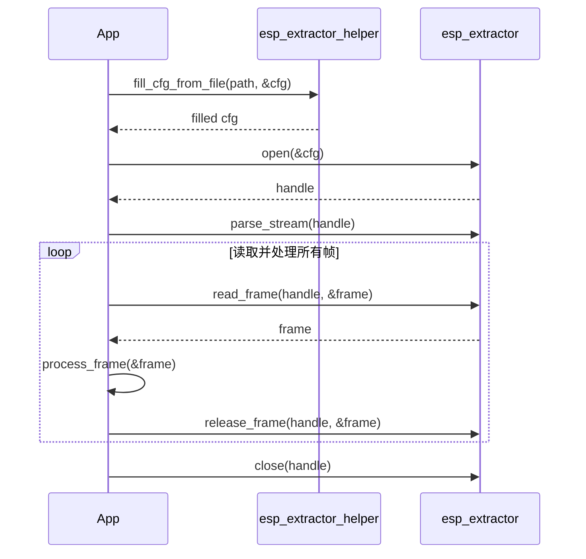

# ESP Extractor 测试应用

## 📖 概述

此测试应用展示了如何在 Espressif 平台上使用 `esp_extractor` 框架从媒体文件中提取音视频帧。它涵盖了三个主要场景：

1.  **标准提取器**：使用内置提取器（MP4, TS, FLV 等），通过 helper 简化基于文件的配置。
2.  **原始提取器**：从没有容器封装的原始基本流（如 Opus, AAC 或 H.264）中提取帧。
3.  **自定义提取器**：实现并注册用户自定义的容器格式处理程序。

---

## 🚀 核心场景

### 1. 标准提取器 (配合 Helper)
`extractor_helper` 提供了便捷的 API，可直接从文件路径分配配置。

```c
// 注册默认提取器
esp_extractor_register_default();

// 使用 helper 从文件创建配置
esp_extractor_config_t *cfg = esp_extractor_alloc_file_config(url, ESP_EXTRACT_MASK_AV, POOL_SIZE);

// 标准流程：打开 -> 解析 -> 读取循环
esp_extractor_open(cfg, &extractor);
esp_extractor_parse_stream(extractor);
// ... read_frame 循环 ...
```

#### ⏱️ 典型调用时序



### 2. 原始提取器
原始提取器（Raw Extractor）用于没有容器格式的流（例如来自网络或 Flash 的原始流）。由于没有头部可解析，您必须**手动提供流信息**。

```c
// 1. 注册原始提取器支持
esp_raw_extractor_register();

// 2. 配置类型为 ESP_EXTRACTOR_TYPE_RAW
esp_extractor_config_t config = {
    .type = ESP_EXTRACTOR_TYPE_RAW,
    .in_read_cb = my_raw_data_reader,
    .out_pool_size = 10 * 1024,
};
esp_extractor_open(&config, &extractor);

// 3. 必选：手动设置流信息（格式、采样率等）
esp_extractor_stream_info_t info = {
    .stream_type = ESP_EXTRACTOR_STREAM_TYPE_AUDIO,
    .audio_info = { .format = ESP_EXTRACTOR_AUDIO_FORMAT_OPUS, .sample_rate = 48000, ... },
};
esp_extractor_ctrl(extractor, ESP_EXTRACTOR_CTRL_TYPE_SET_STREAM_INFO, &info, sizeof(info));

// 4. 为原始读取器设置最大帧大小
uint32_t max_size = 1024;
esp_extractor_ctrl(extractor, ESP_EXTRACTOR_CTRL_TYPE_SET_MAX_FRAME_SIZE, &max_size, sizeof(max_size));

esp_extractor_parse_stream(extractor);
```

### 3. 自定义提取器实现
- 演示如何定义和注册自定义格式处理程序。
- 交织音视频帧，包含 PTS 和大小头部。
- 包含测试文件生成器和帧校验器。

#### 📦 自定义格式规范

```
Header:
MyCodec
A: pcm 16000hz 2ch 16bit
V: mjpeg 1280x720 20fps

Body (交织):
A: pts[4B] size[4B] audio_data
V: pts[4B] size[4B] video_data
```

- **注册方式**: `esp_extractor_register(MY_TYPE, &my_ops_table)`.

---

## 🛠️ 编译与测试

### 配置
- 在 [settings.h](main/settings.h) 中定义 SD 卡的 GPIO。
- 需要在开发板上插入 SD 卡。

### 执行
```bash
idf.py build
idf.py -p <YOUR_DEVICE_PORT> flash monitor
```

---

## 📬 支持
- 发现 Bug？在 GitHub 上提交 Issue：[ESP-GMF Issues](https://github.com/espressif/esp-gmf/issues)

