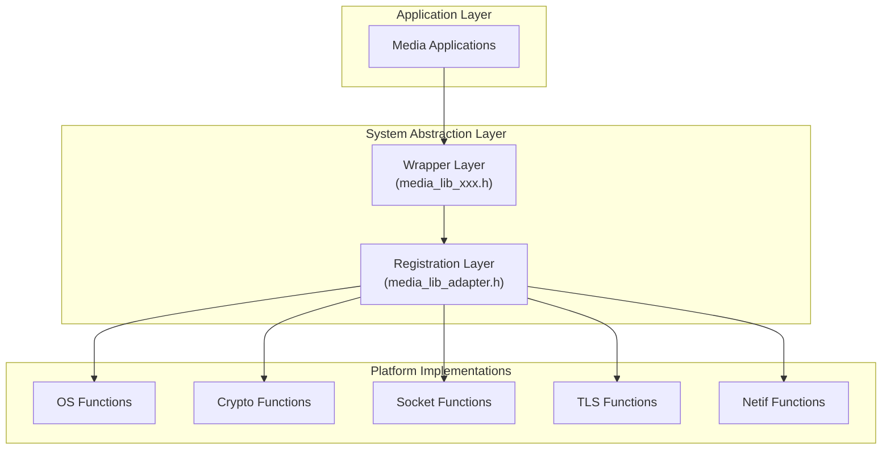

# MEDIA_LIB_SAL (Media Library System Abstraction Layer)

## Overview

The `media_lib_sal` provides a cross-platform abstraction for media libraries and applications.
It enables developers to build media applications in a platform-independent way and even debug on a PC without changing application logic.

The `media_lib_sal` offers a unified interface to interact with:
- Operating system primitives (threads, memory, sync objects)
- Cryptographic operations (MD5, SHA256, AES)
- Networking (sockets, netif)
- TLS/SSL for secure communication

Through its registration mechanism, platform-specific implementations can be plugged in, while applications always use the same wrapper APIs.

## Architecture

The `media_lib_sal` follows a two-layer architecture:

1. **Wrapper Layer** – Public APIs that applications call
2. **Registration Layer** – Interfaces to bind platform-specific implementations

Applications only see the wrapper layer, while hardware or OS vendors provide implementations via the registration layer.

### Architecture Diagram

## Core Components

### 1. Operating System Abstraction (`media_lib_os.h`)

Cross-platform access to OS services:
- Memory management (`malloc`, `calloc`, `realloc`, `free`)
- Thread management (`create`, `destroy`, `sleep`)
- Synchronization primitives (mutex, semaphore, event groups)

### 2. Cryptography (`media_lib_crypt.h`)

Standard crypto wrappers:
- **MD5** – init, update, finish
- **SHA256** – init, update, finish
- **AES** – key setup, CBC encrypt/decrypt

### 3. Socket API (`media_lib_socket.h`)

Unified networking interface:
- **Connection management** – open, bind, connect, listen, accept
- **Data transfer** – send/recv, sendto/recvfrom
- **Socket control** – select, setsockopt, getsockopt

### 4. TLS/SSL (`media_lib_tls.h`)

Abstraction for secure communication:
- Create client/server TLS sessions
- Read/Write encrypted data
- Session management (delete/cleanup)

### 5. Network Interface (`media_lib_netif.h`)

Query and utility functions:
- Get IPv4 information
- Address conversion (`ntoa`)

## Utilities

### Memory Tracing (`media_lib_mem_trace.h`)

Advanced debugging utilities:
- Track memory usage by module
- Detect leaks with stack traces
- Allocation history logging

## Registration Interface (Port Layer)

Platform-specific functions are registered via adapters:

- `media_lib_add_default_adapter()` – Register all defaults
- `media_lib_os_register(...)` – Register custom OS functions
- `media_lib_crypt_register(...)` – Register custom crypto functions
- `media_lib_socket_register(...)` – Register custom socket functions
- `media_lib_tls_register(...)` – Register custom TLS functions
- `media_lib_netif_register(...)` – Register custom netif functions

Users can manually register each component or register all and select the used one by menuconfig, this allows flexible default or custom implementation selection.

## Platform Support

- **ESP32 family (primary target)**
- Easily portable to other platforms by providing new registration functions.

## License

This component is licensed under the Modified MIT License - see the [LICENSE](./LICENSE) file for details.
